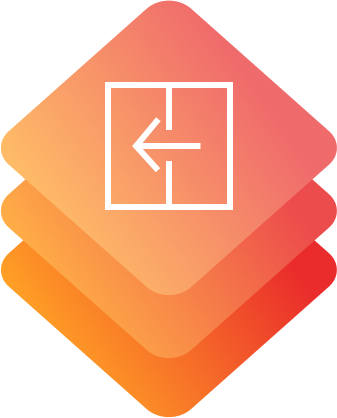
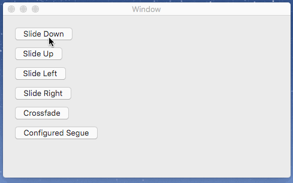

# CustomSegue

[](http://mit-license.org)
[](https://developer.apple.com/resources/)
[](https://developer.apple.com/swift)
[](https://github.com/phimage/CustomSegue/issues)
[](http://cocoadocs.org/docsets/CustomSegue/)

[](#logo)
Custom segue for OSX Storyboards. Slide and cross fade effects, new customized window.

```swift
class MyViewController: NSViewController {

  override func prepareForSegue(segue: NSStoryboardSegue, sender: AnyObject?)
      if segue.identifier == "configured" {
          if let segue = segue as? PresentWithAnimatorSegue, animator = segue.animator as? TransitionAnimator {
              animator.duration = 1
              animator.transition = [.SlideDown, .Crossfade]
          }
      }
  }
```

`TransitionAnimator` transition is configured via [NSViewControllerTransitionOptions](https://developer.apple.com/reference/appkit/nsviewcontrollertransitionoptions), and suppress the need to use a parent controller with `transitionFromViewController` function.

## Demo
In [Example](Example) folder you can launch `pod install` and open `Example.xcworkspace`



## How to use
Use `PresentWithAnimatorSegue` in your storyboard or use one of already configured segue: `SlideDownSegue`, `SlideUpSegue`, `SlideLeftSegue`, `SlideRightSegue`, `ChildWindowSegue`, ...


### Configure segue
In your storyboard add an storyboard identifier to the segue.


Then in your source view controller, you can configure the segue in `prepare(for segue` function.

```swift
class MyViewController: NSViewController {
  override func prepare(for segue: NSStoryboardSegue, sender: AnyObject?) {
    if segue.identifier?.rawValue == "PetDetail" {
    ...
```

You can use [Natalie](https://github.com/krzyzanowskim/Natalie) to generate code about segue for your controller.
With this generate code you can do
```swift
  override func prepare(for segue: NSStoryboardSegue, sender: AnyObject?) {
    if segue.identifier == "PetDetail" {
    // or better the constant generated
    if segue == MyViewController.Segue.petDetail {
```

You can change the duration, the transition type, ... on `animator` object of type `TransitionAnimator`
```swift
if let segue = segue as? PresentWithAnimatorSegue, animator = segue.animator as? TransitionAnimator {
  animator.duration = 1
  animator.transition = [.SlideDown, .Crossfade]
}
```

For `ChildWindowSegue` you can customize the `NSWindow`, which display the destination controller
```swift
if let segue = segue as? ChildWindowSegue, animator = segue.animator as? ChildWindowAnimator {
    animator.windowCustomizer = { window in
      window.styleMask = NSBorderlessWindowMask
      window.setFrameOrigin(NSPoint(...))
    }
}
```


:bulb: You can also put your own custom animator.
```swift
if let segue = segue as? PresentWithAnimatorSegue {
  segue.animator = MyAnimator()
}
```

## Others segues
### ReplaceWindowContentSegue
Replace `contentViewController` of `sourceController` parent `NSWindow` by `destinationController`

:bulb: You can store this segue into `destinationController` and call `unperform` on it to restore `sourceController`

### SplitViewSegue
Segue that replace the last split view item or add a new one into the `sourceController` parent (`NSSplitViewController`)

Set `replace` to `false` on segue, to add a new split view item.

### DismissSegue
Segue to dismiss current from controller

Allow to display in storyboard the action as segue instead of simple `IBAction`

### TransitionFromViewSegue
Segue using parent controller of source and `transitionFromViewController` function

:warning: `parentViewController` must be set and the same for the `sourceController` and `destinationController`

### TablePopoverSegue
Show `destinationController` in a popover with a position relative to the selected table row

:warning: You must set the `tableView` into segue object (do it in `prepareForSegue`)

:bulb: You can display detail about selected row in a nice way. So in `prepareForSegue` get table view selected row and pass data to `destinationController`

## Present view controller utility method
Little utility method added to `NSViewController` using new enum `PresentationMode`.
```swift
viewController.present(.asSheet)
viewController.present(.asModalWindow)
viewController.present(.segue(segueIdentifier: "id"))
viewController.present(.animator(animator: MyAnimator()))
viewController.present(.asPopover(...

```
:warning: `parentViewController` must be set

## Installation

## Using CocoaPods ##
[CocoaPods](https://cocoapods.org/) is a centralized dependency manager for
Objective-C and Swift. Go [here](https://guides.cocoapods.org/using/index.html)
to learn more.

1. Add the project to your [Podfile](https://guides.cocoapods.org/using/the-podfile.html).

    ```ruby
    use_frameworks!

    pod 'CustomSegue'
    ```

2. Run `pod install` and open the `.xcworkspace` file to launch Xcode.


## Using Carthage ##
[Carthage](https://github.com/Carthage/Carthage) is a decentralized dependency manager for Objective-C and Swift.

1. Add the project to your [Cartfile](https://github.com/Carthage/Carthage/blob/master/Documentation/Artifacts.md#cartfile).

    ```
    github "phimage/CustomSegue"
    ```

2. Run `carthage update` and follow [the additional steps](https://github.com/Carthage/Carthage#getting-started)
   in order to add Prephirences to your project.
